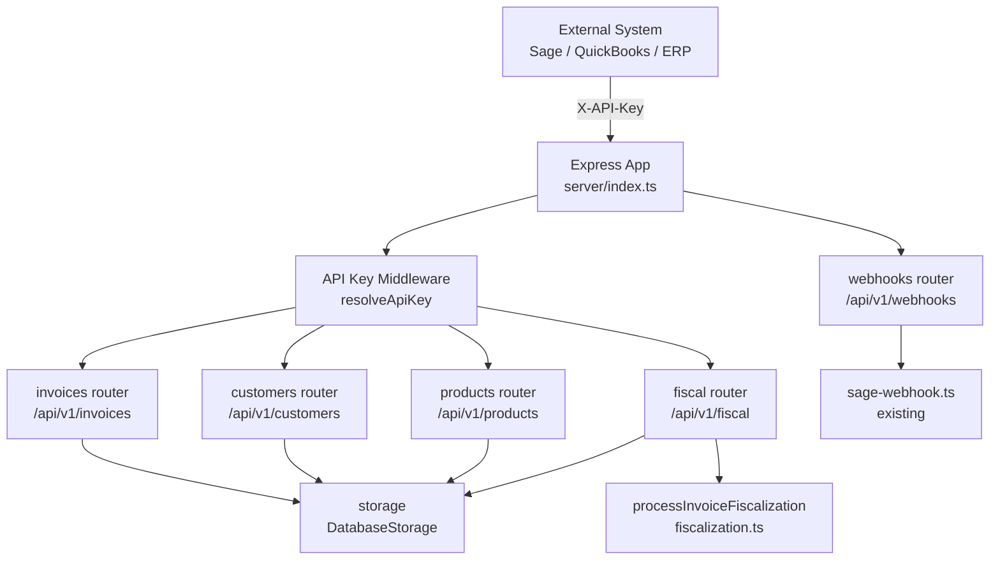
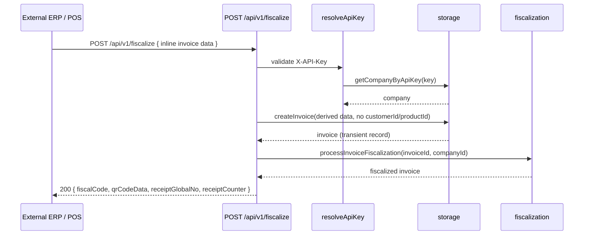
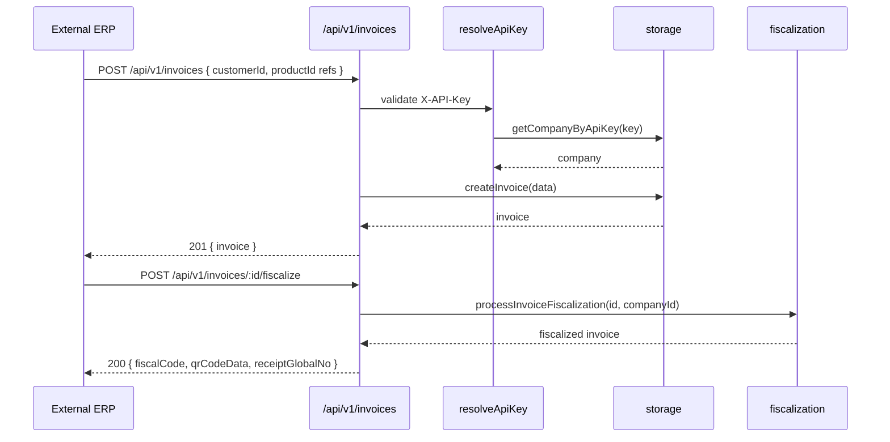
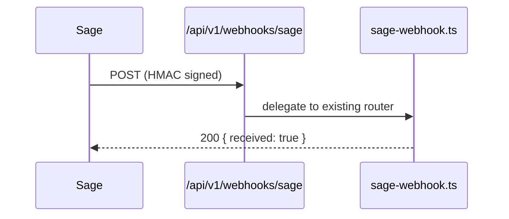

# Design Document: Integration API

## Overview

FiscalStack's Integration API is a clean, versioned REST layer (`/api/v1/`) that exposes core FiscalStack capabilities — invoicing, fiscalization, customers, products, and fiscal status — to external systems such as Sage, QuickBooks, and custom ERPs. It delegates entirely to the existing `storage` layer and `processInvoiceFiscalization` function; no business logic is re-implemented inside the API routes themselves.

The existing `routes.ts` monolith remains untouched. The integration API lives in a dedicated module (`server/api/v1/`) and is mounted once in the main app. Authentication is exclusively via API key (`X-API-Key` header), resolved to a company via the existing `getCompanyByApiKey` storage method.

### Two Integration Modes

The API supports two distinct usage patterns:

**Mode A — Pass-Through Fiscalization** (primary use case for external ERP/POS/inventory systems)
The client has their own system managing customers, products, and inventory. They send raw invoice data inline — no pre-registered customers or products required. The API fiscalizes the invoice and returns the fiscal receipt. Nothing is persisted to the FiscalStack customer/product catalog. The invoice record is created transiently for fiscalization purposes only.

**Mode B — Managed Fiscalization** (for clients using FiscalStack as their primary system)
The client has customers and products registered in FiscalStack. They reference them by ID. The API behaves like a clean programmatic version of the UI.

---

## Architecture



---

## Sequence Diagrams

### Mode A — Pass-Through Fiscalization (external ERP, no pre-registered data)



### Mode B — Managed Fiscalization (FiscalStack as primary system)



### Sage Webhook Flow



---

## Components and Interfaces

### resolveApiKey Middleware

**Purpose**: Authenticate requests using `X-API-Key` header, attach resolved `company` to `req`.

**Interface**:
```typescript
function resolveApiKey(req: Request, res: Response, next: NextFunction): Promise<void>
```

**Responsibilities**:
- Read `X-API-Key` from request headers
- Call `storage.getCompanyByApiKey(key)` to resolve company
- Attach `req.company` for downstream handlers
- Return `401` if key is missing or invalid

---

### Pass-Through Fiscalization Router (`/api/v1/fiscalize`)

**Purpose**: Single-shot endpoint for external systems that manage their own data. Client sends a complete inline invoice, gets back a fiscal receipt. No customer or product records need to exist in FiscalStack.

**Endpoints**:
```
POST   /api/v1/fiscalize             create invoice from inline data + fiscalize in one call
```

This is the primary endpoint for Mode A integrations. It is intentionally a single step — create and fiscalize atomically — so the client doesn't need to manage invoice IDs or state.

---

### Invoices Router (`/api/v1/invoices`)

**Purpose**: CRUD + fiscalization for invoices, scoped to the authenticated company.

**Endpoints**:
```
GET    /api/v1/invoices              list invoices (paginated)
GET    /api/v1/invoices/:id          get single invoice with line items
POST   /api/v1/invoices              create invoice
PUT    /api/v1/invoices/:id          update invoice (draft only)
DELETE /api/v1/invoices/:id          delete invoice (draft only)
POST   /api/v1/invoices/:id/fiscalize  submit to ZIMRA
```

---

### Customers Router (`/api/v1/customers`)

**Purpose**: Manage customer records for the authenticated company.

**Endpoints**:
```
GET    /api/v1/customers             list customers
GET    /api/v1/customers/:id         get customer
POST   /api/v1/customers             create customer
PUT    /api/v1/customers/:id         update customer
```

---

### Products Router (`/api/v1/products`)

**Purpose**: Manage product/service catalog for the authenticated company.

**Endpoints**:
```
GET    /api/v1/products              list products
POST   /api/v1/products              create product
PUT    /api/v1/products/:id          update product
```

---

### Fiscal Router (`/api/v1/fiscal`)

**Purpose**: Expose fiscal device status and day management for external integrations.

**Endpoints**:
```
GET    /api/v1/fiscal/status         get current fiscal day status
POST   /api/v1/fiscal/open-day       open fiscal day
POST   /api/v1/fiscal/close-day      close fiscal day
```

---

### Webhooks Router (`/api/v1/webhooks`)

**Purpose**: Receive inbound webhooks from external systems. No API key required (uses own signature verification per provider).

**Endpoints**:
```
POST   /api/v1/webhooks/sage         delegate to existing sage-webhook router
```

---

## Data Models

### Mode A — Pass-Through Fiscalize Request (`POST /api/v1/fiscalize`)

The client sends everything inline. No IDs, no pre-registered records needed.

```typescript
interface PassThroughFiscalizeRequest {
  // --- Line items (required) ---
  items: PassThroughItem[]

  // --- Buyer info (optional — for B2B, include for ZIMRA buyer data) ---
  buyer?: {
    name: string
    vatNumber?: string
    tin?: string
    phone?: string
    email?: string
  }

  // --- Invoice metadata (all optional, system fills defaults) ---
  invoiceNumber?: string            // client's own reference number; auto-generated if omitted
  date?: string                     // ISO 8601 — defaults to today
  paymentMethod?: "CASH" | "CARD" | "MOBILE" | "TRANSFER"  // defaults to "CASH"
  currency?: string                 // defaults to company's default currency
  notes?: string
  transactionType?: "FiscalInvoice" | "CreditNote" | "DebitNote"  // defaults to "FiscalInvoice"
  relatedFiscalCode?: string        // for CreditNote/DebitNote: fiscal code of original invoice
}

interface PassThroughItem {
  description: string               // required — what was sold
  quantity: number                  // required
  unitPrice: number                 // required — pre-tax unit price
  taxRate?: number                  // defaults to company standard rate (e.g. 15%)
  hsCode?: string                   // defaults to company default HS code if omitted
}
```

**Minimal valid request** — the absolute least a client needs to send:
```json
{
  "items": [
    { "description": "Consulting Services", "quantity": 1, "unitPrice": 500 }
  ]
}
```

**B2B request with buyer info**:
```json
{
  "buyer": { "name": "Acme Corp", "tin": "1234567890", "vatNumber": "V12345" },
  "paymentMethod": "TRANSFER",
  "items": [
    { "description": "Software License", "quantity": 3, "unitPrice": 200, "taxRate": 15 },
    { "description": "Support (Exempt)", "quantity": 1, "unitPrice": 100, "taxRate": 0 }
  ]
}
```

---

### Mode A — Pass-Through Fiscalize Response

```typescript
interface PassThroughFiscalizeResponse {
  fiscalCode: string          // ZIMRA receipt hash
  qrCodeData: string          // QR code string for printing
  receiptGlobalNo: number     // ZIMRA global receipt number
  receiptCounter: number      // daily receipt counter
  fiscalDayNo: number
  invoiceNumber: string       // the number assigned (client's ref or auto-generated)
  total: string               // computed total for confirmation
  date: string                // receipt date used (Harare local time)
}
```

---

### Mode B — Managed Invoice Request (`POST /api/v1/invoices`)

The client references pre-registered customers and products by ID.

```typescript
interface CreateInvoiceRequest {
  items: InvoiceItemRequest[]       // at least one line item required
  customerId?: number               // omit for walk-in / cash sale
  issueDate?: string                // defaults to today
  paymentMethod?: "CASH" | "CARD" | "MOBILE" | "TRANSFER"  // defaults to "CASH"
  notes?: string
  relatedInvoiceId?: number         // required only for CreditNote / DebitNote
  transactionType?: "FiscalInvoice" | "CreditNote" | "DebitNote"
}

interface InvoiceItemRequest {
  description: string
  quantity: number
  unitPrice: number
  productId?: number                // if provided, taxRate/hsCode pulled from product record
  taxRate?: number                  // only needed if productId not provided
}
```

### API Invoice Response

```typescript
interface InvoiceResponse {
  id: number
  invoiceNumber: string
  status: string
  transactionType: string
  issueDate: string
  dueDate: string
  currency: string
  subtotal: string
  taxAmount: string
  total: string
  fiscalCode: string | null
  qrCodeData: string | null
  receiptGlobalNo: number | null
  receiptCounter: number | null
  fiscalDayNo: number | null
  customer?: CustomerResponse
  items: InvoiceItemResponse[]
}
```

### API Customer Request/Response

```typescript
interface CustomerRequest {
  name: string
  email?: string
  phone?: string
  address?: string
  vatNumber?: string
  tin?: string
}

interface CustomerResponse {
  id: number
  name: string
  email: string | null
  phone: string | null
  vatNumber: string | null
  tin: string | null
}
```

### Fiscalize Response

```typescript
interface FiscalizeResponse {
  invoiceId: number
  invoiceNumber: string
  fiscalCode: string
  qrCodeData: string
  receiptGlobalNo: number
  receiptCounter: number
  fiscalDayNo: number
}
```

### API Error Response

```typescript
interface ApiError {
  error: string       // machine-readable code, e.g. "INVOICE_NOT_FOUND"
  message: string     // human-readable description
  statusCode: number
}
```

---

## Key Functions with Formal Specifications

### resolveApiKey

```typescript
async function resolveApiKey(req, res, next): Promise<void>
```

**Preconditions**:
- `req.headers['x-api-key']` may or may not be present

**Postconditions**:
- If key present and valid: `req.company` is set, `next()` called
- If key missing or invalid: responds `401`, `next()` not called
- No mutation of company data

---

### createInvoiceHandler

```typescript
async function createInvoiceHandler(req, res): Promise<void>
```

**Preconditions**:
- `req.company` is set (middleware ran)
- `req.body.items` is a non-empty array
- Each item has `description`, `quantity`, `unitPrice`

**Postconditions**:
- Server derives: `invoiceNumber`, `dueDate`, `currency`, `taxInclusive`, `lineTotal`, `subtotal`, `taxAmount`, `total`
- If `productId` supplied on an item, `taxRate` and `hsCode` are pulled from the product record
- Invoice created via `storage.createInvoice()`
- Response is `201` with full `InvoiceResponse`
- `companyId` is always taken from `req.company.id`, never from request body

---

### fiscalizeHandler

```typescript
async function fiscalizeHandler(req, res): Promise<void>
```

**Preconditions**:
- Invoice with `req.params.id` exists and belongs to `req.company.id`
- Invoice status is not already `fiscalized`

**Postconditions**:
- Delegates to `processInvoiceFiscalization(invoiceId, companyId)`
- On success: responds `200` with `FiscalizeResponse`
- On failure: responds `422` with structured `ApiError`
- No fiscalization logic re-implemented in this handler

---

## Algorithmic Pseudocode

### Pass-Through Fiscalize Handler

```pascal
ALGORITHM passThroughFiscalizeHandler(req, res)
INPUT: PassThroughFiscalizeRequest, req.company
OUTPUT: PassThroughFiscalizeResponse or ApiError

BEGIN
  company ← req.company

  // 1. Build line items — no product lookup needed
  FOR EACH item IN req.body.items DO
    item.taxRate  ← item.taxRate ?? company.defaultTaxRate ?? 15
    item.hsCode   ← item.hsCode ?? company.defaultHsCode ?? "04021099"
    item.lineTotal ← item.quantity × item.unitPrice
  END FOR

  // 2. Compute totals
  subtotal  ← SUM(item.lineTotal)
  taxAmount ← SUM(item.lineTotal × item.taxRate / 100)
  total     ← subtotal + taxAmount

  // 3. Build buyer data from inline buyer field (no customer record created)
  buyerData ← req.body.buyer ?? NULL

  // 4. Create transient invoice record (needed by processInvoiceFiscalization)
  invoice ← storage.createInvoice({
    companyId:       company.id,
    customerId:      NULL,           // no customer record
    invoiceNumber:   req.body.invoiceNumber ?? storage.nextInvoiceNumber(company.id),
    issueDate:       req.body.date ?? TODAY,
    dueDate:         req.body.date ?? TODAY,
    currency:        req.body.currency ?? company.currency ?? "USD",
    taxInclusive:    false,
    paymentMethod:   req.body.paymentMethod ?? "CASH",
    transactionType: req.body.transactionType ?? "FiscalInvoice",
    subtotal, taxAmount, total,
    buyerName:       buyerData?.name ?? NULL,
    buyerVat:        buyerData?.vatNumber ?? NULL,
    buyerTin:        buyerData?.tin ?? NULL,
    notes:           req.body.notes ?? NULL,
    items,
    status: "pending"
  })

  // 5. Fiscalize
  TRY
    result ← processInvoiceFiscalization(invoice.id, company.id)
    RETURN respond(200, {
      fiscalCode:     result.fiscalCode,
      qrCodeData:     result.qrCodeData,
      receiptGlobalNo: result.receiptGlobalNo,
      receiptCounter: result.receiptCounter,
      fiscalDayNo:    result.fiscalDayNo,
      invoiceNumber:  result.invoiceNumber,
      total:          result.total,
      date:           result.receiptDate
    })
  CATCH error
    RETURN respond(422, { error: "FISCALIZATION_FAILED", message: error.message })
  END TRY
END
```

### Invoice Creation — Server-Side Derivation

```pascal
ALGORITHM buildInvoiceFromRequest(req)
INPUT: minimal CreateInvoiceRequest, req.company
OUTPUT: full invoice payload ready for storage.createInvoice()

BEGIN
  company ← req.company

  // Derive per-item computed fields
  FOR EACH item IN req.body.items DO
    IF item.productId IS NOT NULL THEN
      product ← storage.getProduct(item.productId)
      item.taxRate  ← product.taxRate
      item.hsCode   ← product.hsCode
    ELSE
      item.taxRate  ← item.taxRate ?? company.defaultTaxRate ?? 15
    END IF
    item.lineTotal ← item.quantity × item.unitPrice
  END FOR

  // Derive invoice-level fields
  subtotal   ← SUM(item.lineTotal FOR EACH item)
  taxAmount  ← SUM(item.lineTotal × item.taxRate / 100 FOR EACH item)
  total      ← subtotal + taxAmount

  RETURN {
    companyId:       company.id,
    customerId:      req.body.customerId ?? NULL,
    invoiceNumber:   storage.nextInvoiceNumber(company.id),
    issueDate:       req.body.issueDate ?? TODAY,
    dueDate:         req.body.issueDate ?? TODAY,   // fiscal invoices paid on issue
    currency:        company.currency ?? "USD",
    taxInclusive:    company.taxInclusive ?? false,
    paymentMethod:   req.body.paymentMethod ?? "CASH",
    transactionType: req.body.transactionType ?? "FiscalInvoice",
    relatedInvoiceId: req.body.relatedInvoiceId ?? NULL,
    notes:           req.body.notes ?? NULL,
    subtotal, taxAmount, total,
    items,
    status: "pending"
  }
END
```

### Main Request Lifecycle

```pascal
ALGORITHM handleApiRequest(req, res)
INPUT: HTTP request with X-API-Key header
OUTPUT: HTTP response

BEGIN
  // Middleware phase
  apiKey ← req.headers['x-api-key']
  IF apiKey IS NULL THEN
    RETURN respond(401, { error: "MISSING_API_KEY" })
  END IF

  company ← storage.getCompanyByApiKey(apiKey)
  IF company IS NULL THEN
    RETURN respond(401, { error: "INVALID_API_KEY" })
  END IF

  req.company ← company

  // Route handler phase
  CALL routeHandler(req, res)
END
```

### Invoice Fiscalization Handler

```pascal
ALGORITHM fiscalizeHandler(req, res)
INPUT: req.params.id (invoiceId), req.company.id (companyId)
OUTPUT: FiscalizeResponse or ApiError

BEGIN
  invoiceId ← parseInt(req.params.id)
  companyId ← req.company.id

  invoice ← storage.getInvoice(invoiceId)
  IF invoice IS NULL OR invoice.companyId ≠ companyId THEN
    RETURN respond(404, { error: "INVOICE_NOT_FOUND" })
  END IF

  IF invoice.fiscalCode IS NOT NULL THEN
    RETURN respond(409, { error: "ALREADY_FISCALIZED" })
  END IF

  TRY
    result ← processInvoiceFiscalization(invoiceId, companyId)
    RETURN respond(200, mapToFiscalizeResponse(result))
  CATCH error
    RETURN respond(422, { error: "FISCALIZATION_FAILED", message: error.message })
  END TRY
END
```

### Company Scope Guard

```pascal
ALGORITHM assertCompanyOwnership(resourceCompanyId, req)
INPUT: resourceCompanyId (from DB record), req.company.id (from API key)
OUTPUT: throws if mismatch

BEGIN
  IF resourceCompanyId ≠ req.company.id THEN
    THROW ApiError(404, "NOT_FOUND")
    // Return 404 not 403 to avoid leaking resource existence
  END IF
END
```

---

## File Structure

```
server/
  api/
    v1/
      index.ts          ← mounts all v1 routers, exports v1Router
      middleware.ts     ← resolveApiKey
      fiscalize.ts      ← POST /fiscalize (Mode A — pass-through, no pre-registered data needed)
      invoices.ts       ← CRUD + /fiscalize (Mode B — managed, uses customer/product IDs)
      customers.ts      ← CRUD
      products.ts       ← CRUD
      fiscal.ts         ← fiscal status/day router
      webhooks.ts       ← delegates to sage-webhook router
```

Mounted in `server/routes.ts` (or `server/index.ts`) as:
```typescript
app.use('/api/v1', v1Router);
```

---

## Error Handling

### Scenario 1: Invalid or Missing API Key

**Condition**: `X-API-Key` header absent or not found in `companies` table
**Response**: `401 { error: "INVALID_API_KEY", message: "..." }`
**Recovery**: Client must supply a valid key

### Scenario 2: Resource Not Found / Wrong Company

**Condition**: Invoice/customer/product ID doesn't exist or belongs to a different company
**Response**: `404 { error: "NOT_FOUND", message: "..." }`
**Recovery**: Always 404 (not 403) to avoid leaking existence of other companies' data

### Scenario 3: Fiscalization Failure

**Condition**: ZIMRA rejects the receipt (device not registered, day closed, validation error)
**Response**: `422 { error: "FISCALIZATION_FAILED", message: "<zimra error>" }`
**Recovery**: Client should inspect message, fix data, retry

### Scenario 4: Validation Error

**Condition**: Request body fails schema validation
**Response**: `400 { error: "VALIDATION_ERROR", message: "...", details: [...] }`
**Recovery**: Client fixes request payload

### Scenario 5: Duplicate Fiscalization

**Condition**: `POST /fiscalize` called on an already-fiscalized invoice
**Response**: `409 { error: "ALREADY_FISCALIZED", fiscalCode: "..." }`
**Recovery**: Client reads existing fiscal data from the `409` response body

---

## Testing Strategy

### Unit Testing Approach

Each router handler is tested in isolation with a mocked `storage` and mocked `processInvoiceFiscalization`. Tests verify:
- Correct delegation to storage methods (no inline logic)
- Company scope enforcement (cross-company access returns 404)
- Correct HTTP status codes for each scenario

### Property-Based Testing Approach

**Property Test Library**: fast-check

Key properties:
- For any valid `CreateInvoiceRequest`, `companyId` in the created invoice always equals `req.company.id`
- For any invoice not belonging to the authenticated company, the response is always `404`
- `fiscalizeHandler` never calls `processInvoiceFiscalization` if `invoice.fiscalCode` is already set

### Integration Testing Approach

End-to-end tests using a test database:
- Full create → fiscalize flow with a real company API key
- Sage webhook signature verification (valid and tampered payloads)
- Pagination correctness for invoice listing

---

## Security Considerations

- API keys are resolved via `storage.getCompanyByApiKey()` — constant-time lookup via indexed column
- All resource access is scoped to `req.company.id`; no user-supplied `companyId` is trusted
- Webhook endpoints use their own signature verification (HMAC-SHA256 for Sage) — not API key auth
- API keys should be rotated via the existing `/api/companies/:id/api-keys/rotate` endpoint
- Rate limiting should be applied at the reverse proxy / gateway layer (out of scope for this spec)

---

## Dependencies

- `server/storage.ts` — `DatabaseStorage` / `IStorage` interface
- `server/lib/fiscalization.ts` — `processInvoiceFiscalization`
- `server/lib/sage-webhook.ts` — existing Sage webhook router (delegated to, not replaced)
- `express` — routing
- `zod` — request body validation

---

## Correctness Properties

*A property is a characteristic or behavior that should hold true across all valid executions of a system — essentially, a formal statement about what the system should do. Properties serve as the bridge between human-readable specifications and machine-verifiable correctness guarantees.*

### Property 1: Invalid API key always returns 401

*For any* HTTP request to a `/api/v1/` endpoint where the `X-API-Key` header is absent or does not match any company record, the response status code must be 401.

**Validates: Requirements 1.3, 1.4**

---

### Property 2: Valid API key attaches company to request context

*For any* HTTP request carrying a valid `X-API-Key`, the resolved company object attached to the request context must equal the company record returned by `Storage.getCompanyByApiKey()` for that key.

**Validates: Requirements 1.2**

---

### Property 3: companyId always comes from API key, never from request body

*For any* invoice, customer, or product created via the API, the `companyId` stored on the created record must equal the `id` of the company resolved from the `X-API-Key` header, regardless of any `companyId` value present in the request body.

**Validates: Requirements 2.15, 3.6, 9.1**

---

### Property 4: Cross-company resource access always returns 404

*For any* request to access, update, or delete a resource (invoice, customer, product) by ID where that resource's `companyId` does not match the authenticated company's ID, the response status code must be 404 — never 403 or 200.

**Validates: Requirements 3.9, 4.2, 9.2, 9.3**

---

### Property 5: Invoice total arithmetic is always correct

*For any* set of line items with given `quantity`, `unitPrice`, and `taxRate` values, the API-computed `lineTotal` must equal `quantity × unitPrice`, `subtotal` must equal the sum of all `lineTotal` values, `taxAmount` must equal the sum of each item's `lineTotal × taxRate / 100`, and `total` must equal `subtotal + taxAmount`.

**Validates: Requirements 2.11, 3.5**

---

### Property 6: Item defaults are applied when optional fields are omitted

*For any* pass-through or managed invoice request where an item omits `taxRate`, the computed `taxAmount` for that item must reflect the company's configured default tax rate, or 15% if no company default is set. Similarly, an omitted `hsCode` must resolve to the company default or `"04021099"`.

**Validates: Requirements 2.3, 2.4, 3.4**

---

### Property 7: Buyer info is stored inline without creating customer records

*For any* pass-through fiscalization request that includes a `buyer` object, the `Storage.createCustomer()` method must never be called, and the buyer's name, VAT number, and TIN must appear on the created invoice record.

**Validates: Requirements 2.5**

---

### Property 8: Validation errors return 400 with a details array

*For any* request body that fails schema validation (missing required fields, wrong types, empty items array, negative numeric values), the response must have status 400, error code `VALIDATION_ERROR`, and a non-empty `details` array describing each failure.

**Validates: Requirements 10.2, 10.3, 10.4**

---

### Property 9: All error responses follow the standard shape

*For any* error condition encountered by the API, the response body must be an object containing exactly the fields `error` (machine-readable string code), `message` (human-readable string), and `statusCode` (integer matching the HTTP status).

**Validates: Requirements 11.1, 11.2, 11.3, 11.4**

---

### Property 10: productId on a line item causes tax and HS code to be pulled from the product record

*For any* managed invoice creation request where a line item includes a `productId`, the `taxRate` and `hsCode` used for that line item in the stored invoice must equal the values from the product record retrieved from Storage, regardless of any `taxRate` value supplied inline on the item.

**Validates: Requirements 3.3**

---

### Property 11: Re-fiscalizing an already-fiscalized invoice returns 409

*For any* invoice that already has a non-null `fiscalCode`, a `POST /api/v1/invoices/:id/fiscalize` request must return HTTP 409 with error code `ALREADY_FISCALIZED`, and `Fiscalization.processInvoiceFiscalization()` must not be called.

**Validates: Requirements 4.3**

---

### Property 12: Fiscalization failure returns 422 with FISCALIZATION_FAILED

*For any* fiscalization attempt where `Fiscalization.processInvoiceFiscalization()` throws an error, the API response must have status 422 and error code `FISCALIZATION_FAILED`, and the `message` field must contain the original error message from the fiscalization layer.

**Validates: Requirements 2.13, 4.4**
