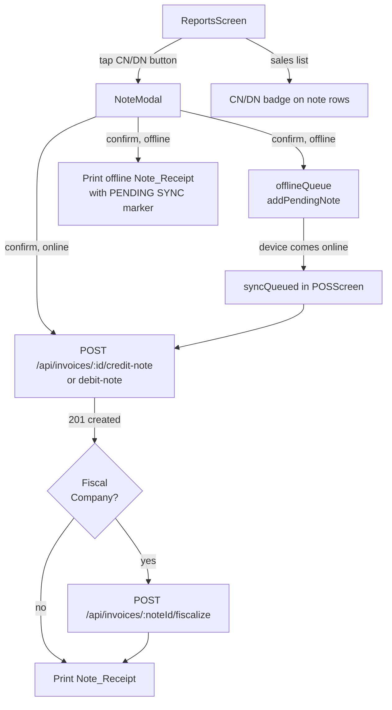

# Design Document: Mobile Credit & Debit Notes

## Overview

This feature adds Credit Note and Debit Note issuance to the React Native / Expo mobile POS app. Cashiers initiate a note from the ReportsScreen by expanding an existing sale, adjusting line items in a full-screen modal, and confirming. The resulting note is created via existing backend endpoints (with a server-side extension to accept custom items), fiscalised automatically for VAT-registered companies, and a receipt is printed. Notes queue offline when connectivity is unavailable, and credit notes above a configurable threshold require a manager PIN — consistent with the existing discount override pattern.

The feature touches four layers:
1. **Server** — extend credit-note and debit-note endpoints to accept an optional `items` override.
2. **Offline queue** — add a Note_Queue alongside the existing sale and shift queues.
3. **Printing** — extend `TicketData` and both print paths to support note-type receipts.
4. **UI** — add CN/DN buttons to `ExpandedSaleContent`, a new `NoteModal` component, CN/DN badges in the sales list, and sync integration in `POSScreen`.

---

## Architecture



The sync flow mirrors the existing `syncQueued` function in `POSScreen.tsx`. The `syncQueued` function is extended to also flush `pendingNotes` after flushing sales and shift actions.

---

## Components and Interfaces

### 1. Server-side change — `server/routes.ts`

Both `POST /api/invoices/:id/credit-note` and `POST /api/invoices/:id/debit-note` are updated to accept an optional `items` array in the request body. When provided, the supplied items replace the copy from the original invoice. This enables partial returns.

```typescript
// Request body shape (both endpoints)
interface NoteRequestBody {
  items?: Array<{
    productId?: number;
    description: string;
    quantity: string;       // stringified decimal, matches existing invoice item shape
    unitPrice: string;
    taxRate: string;
    taxTypeId?: number | null;
    lineTotal: string;
  }>;
  reason?: string;          // free-text reason, stored in invoice.notes
  cashierName?: string;     // attributed to issuing cashier
}
```

The endpoints already set `relatedInvoiceId` from the original invoice — no change needed there.

### 2. `mobile/src/lib/offlineQueue.ts` — Note_Queue extension

Add three new exports alongside the existing sale/shift queue functions:

```typescript
type PendingNote = {
  id: string;
  companyId: number;
  originalInvoiceId: number;
  noteType: "credit" | "debit";
  payload: NoteRequestBody & { originalInvoiceNumber?: string }; // for offline receipt
  createdAt: string;
};

// KEYS addition:
const KEYS = {
  ...existing,
  pendingNotes: "pendingNotes",
};

export async function addPendingNote(
  companyId: number,
  originalInvoiceId: number,
  noteType: "credit" | "debit",
  payload: any
): Promise<string>

export async function getPendingNotes(companyId: number): Promise<PendingNote[]>

export async function removePendingNote(id: string): Promise<void>
```

Storage key: `"pendingNotes"` — a JSON array of `PendingNote` objects, same pattern as `pendingSales`.

### 3. `mobile/src/lib/printing.ts` — Note receipt extension

Extend `TicketData` with an optional `noteType` field:

```typescript
export interface TicketData {
  // ...existing fields...
  noteType?: "credit" | "debit";
  originalInvoiceNumber?: string; // "Ref: INV-0042" line
}
```

Behaviour changes when `noteType` is set:

| Field | Credit Note | Debit Note |
|---|---|---|
| Receipt title | `CREDIT NOTE` | `DEBIT NOTE` |
| Fiscal title | `FISCAL CREDIT NOTE` | `FISCAL DEBIT NOTE` |
| Fiscal marker | `*** FISCAL CREDIT NOTE ***` | `*** FISCAL DEBIT NOTE ***` |
| Ref line | `Ref: {originalInvoiceNumber}` | `Ref: {originalInvoiceNumber}` |
| Offline marker | `*** PENDING SYNC ***` | `*** PENDING SYNC ***` |

Both `generateReceiptHtml` and `printToBluetooth` are updated with the same conditional logic.

### 4. `mobile/src/components/NoteModal.tsx` — new file

Full-screen modal component. Props:

```typescript
interface NoteModalProps {
  visible: boolean;
  noteType: "credit" | "debit";
  originalInvoice: any;          // the sale object from ReportsScreen
  originalItems: any[];          // fetched via useInvoiceItems
  companyId: number;
  company: any;
  creditThreshold: number;       // default 50.00, from AsyncStorage/settings
  currencySymbol: string;
  cashierName?: string;
  printerConfig: PrinterConfig;
  onClose: () => void;
  onSuccess: (note: any) => void;
}
```

Internal state:
- `adjustedItems`: array mirroring `originalItems` with mutable `qty` and `unitPrice` per row
- `reason`: string (max 200 chars)
- `isSubmitting`: boolean
- `showPinModal`: boolean — shown when credit note total > threshold
- `error`: string | null

Sections (top to bottom):
1. Header — note type + original invoice number + close button
2. Scrollable item list — each row: description, qty stepper (−/+, clamped 0..originalQty), unit price `TextInput`, line total (computed)
3. Reason `TextInput` (optional, maxLength 200)
4. Running total footer
5. Cancel / Confirm buttons

On Confirm:
- Validate: at least one qty > 0, all prices ≥ 0
- If credit note and total > threshold → show `ManagerPinModal`
- If online → POST to backend → on 201: fiscalise if fiscal company → offer print → call `onSuccess`
- If offline → `addPendingNote` → offer print with PENDING SYNC marker → call `onSuccess`

### 5. `mobile/src/screens/ReportsScreen.tsx` — modifications

**`ExpandedSaleContent`** receives two new props:
```typescript
onCreditNote: (sale: any, items: any[]) => void;
onDebitNote: (sale: any, items: any[]) => void;
```

The "Credit Note" and "Debit Note" buttons are rendered only when `sale.status === "issued" || sale.status === "paid"`. They sit alongside the existing "Reprint" button in `saleFooter`.

**Sales list row** — in `renderItem`, when `sale.transactionType === "CreditNote"` or `"DebitNote"`, render a small badge:
- CN: orange background, text "CN"
- DN: purple background, text "DN"
- Sub-label: `Ref: {sale.relatedInvoiceId}` (or `relatedInvoiceNumber` if available)

**NoteModal state** added to `ReportsScreen`:
```typescript
const [noteModal, setNoteModal] = useState<{
  visible: boolean;
  noteType: "credit" | "debit";
  sale: any;
  items: any[];
} | null>(null);
```

### 6. `mobile/src/screens/POSScreen.tsx` — sync extension

`syncQueued` is extended to flush `pendingNotes` after sales:

```typescript
const notes = await getPendingNotes(companyId);
for (const note of notes) {
  const endpoint = note.noteType === "credit"
    ? `/api/invoices/${note.originalInvoiceId}/credit-note`
    : `/api/invoices/${note.originalInvoiceId}/debit-note`;
  const res = await apiFetch(endpoint, { method: "POST", body: JSON.stringify(note.payload) });
  if (res.ok) {
    const created = await res.json();
    await removePendingNote(note.id);
    successCount++;
    // Fiscalise if fiscal company
    if (isFiscalCompany) {
      await apiFetch(`/api/invoices/${created.id}/fiscalize`, { method: "POST" }).catch(() => {});
    }
  }
}
```

The `queueCount` state already polls `getPendingSales` + `getPendingShiftActions`; it is updated to also include `getPendingNotes`.

---

## Data Models

### PendingNote (AsyncStorage)

```typescript
{
  id: string;                    // uid() — local reference
  companyId: number;
  originalInvoiceId: number;
  noteType: "credit" | "debit";
  payload: {
    items: AdjustedItem[];
    reason?: string;
    cashierName?: string;
    originalInvoiceNumber?: string;  // for offline receipt only, not sent to server
  };
  createdAt: string;             // ISO 8601
}
```

### AdjustedItem (sent to server)

```typescript
{
  productId?: number;
  description: string;
  quantity: string;       // "2" — only items with qty > 0 are included
  unitPrice: string;      // "15.00"
  taxRate: string;        // preserved from original
  taxTypeId?: number | null;
  lineTotal: string;      // quantity * unitPrice, computed client-side
}
```

### NoteModal internal item state

```typescript
{
  originalItem: any;      // reference to original invoice item
  qty: number;            // 0..originalQty
  unitPrice: number;      // ≥ 0
}
```

### TicketData extension

```typescript
noteType?: "credit" | "debit";
originalInvoiceNumber?: string;
```

---

## Correctness Properties

*A property is a characteristic or behavior that should hold true across all valid executions of a system — essentially, a formal statement about what the system should do. Properties serve as the bridge between human-readable specifications and machine-verifiable correctness guarantees.*

### Property 1: Button visibility matches invoice status

*For any* sale row rendered in `ExpandedSaleContent`, the "Credit Note" and "Debit Note" buttons are visible if and only if `sale.status` is `"issued"` or `"paid"`, and hidden for all other status values.

**Validates: Requirements 1.3, 1.4**

---

### Property 2: Note total never exceeds original invoice total

*For any* set of item adjustments applied in `NoteModal`, the computed note total (sum of `qty * unitPrice` for all adjusted items) must be less than or equal to the original invoice total.

**Validates: Requirements 2.2, 2.3, 2.5**

---

### Property 3: All-zero-quantity note is rejected

*For any* note where every line item has an adjusted quantity of `0`, tapping Confirm must not submit the note and must display a validation error.

**Validates: Requirements 8.1, 8.2**

---

### Property 4: Negative unit price is rejected

*For any* note where at least one line item has a unit price less than `0`, tapping Confirm must not submit the note and must display a validation error.

**Validates: Requirements 8.3, 8.4**

---

### Property 5: Manager PIN required iff credit note total exceeds threshold

*For any* credit note total `T` and credit threshold `C`: the `ManagerPinModal` is shown if and only if `T > C`. For debit notes of any amount, the `ManagerPinModal` is never shown.

**Validates: Requirements 3.1, 3.4, 3.5**

---

### Property 6: Offline note survives app restart

*For any* note added to the Note_Queue via `addPendingNote`, after clearing all in-memory state and re-reading from AsyncStorage via `getPendingNotes`, the note must still be present with all fields intact.

**Validates: Requirements 5.1, 5.7**

---

### Property 7: Note receipt contains type label and original invoice reference

*For any* call to `generateReceiptHtml` or `printToBluetooth` with `noteType` set, the output must contain the correct note type label (`"CREDIT NOTE"` or `"DEBIT NOTE"`) and the string `"Ref: {originalInvoiceNumber}"`.

**Validates: Requirements 6.2, 6.3**

---

### Property 8: Note payload preserves original invoice financial metadata

*For any* note created from an original invoice, the `currency`, `exchangeRate`, `taxRate`, and `taxTypeId` of each line item in the submitted payload must equal the corresponding values from the original invoice.

**Validates: Requirements 8.5, 8.6**

---

### Property 9: relatedInvoiceId always equals original invoice ID

*For any* note creation request (online or queued offline), the `relatedInvoiceId` field in the payload must equal the `id` of the original invoice from which the note was initiated.

**Validates: Requirements 9.1**

---

### Property 10: Fiscalisation called iff online and fiscal company

*For any* note creation: fiscalisation (`POST /api/invoices/:noteId/fiscalize`) is called if and only if the device is online at creation time AND the company is a Fiscal_Company (`vatRegistered === true && vatNumber` is set). Offline-queued notes must not trigger fiscalisation at queue time.

**Validates: Requirements 10.1, 10.4**

---

### Property 11: Reason field enforces 200-character limit

*For any* string input into the Reason field, the value stored and submitted must be at most 200 characters.

**Validates: Requirements 2.6**

---

## Error Handling

| Scenario | Behaviour |
|---|---|
| Backend returns non-2xx on note creation | Display error message from response body; keep NoteModal open for retry |
| Fiscalisation fails after successful note creation | Show success for note creation + separate warning for fiscalisation failure; offer retry button |
| Manager PIN verification fails | Show error in ManagerPinModal; allow retry or cancel |
| All items have qty = 0 on Confirm | Show inline validation error; do not submit |
| Any unit price is negative on Confirm | Show inline validation error; do not submit |
| Offline note fails to sync after reconnect | Retain in Note_Queue; retry on next sync cycle |
| `printToBluetooth` throws (BT not available) | Alert with error message; note creation is unaffected |
| Original invoice not found (deleted) | Backend returns 404; display "Invoice not found" error in NoteModal |

---

## Testing Strategy

### Unit Tests

Focus on specific examples, edge cases, and integration points:

- `NoteModal` renders all original invoice items on open
- `NoteModal` shows CN/DN buttons only for `status === "issued" | "paid"`
- `NoteModal` calls `addPendingNote` when offline, not the API
- `NoteModal` calls `ManagerPinModal` when credit note total > threshold
- `NoteModal` does NOT call `ManagerPinModal` for debit notes
- `syncQueued` flushes `pendingNotes` and calls fiscalise for fiscal companies
- `generateReceiptHtml` with `noteType="credit"` contains `"CREDIT NOTE"` and `"Ref:"`
- `addPendingNote` / `getPendingNotes` / `removePendingNote` round-trip

### Property-Based Tests

Use **fast-check** (already available in the JS/TS ecosystem) with minimum **100 iterations** per property.

Each test is tagged with: `Feature: mobile-credit-debit-notes, Property {N}: {property_text}`

**Property 1 — Button visibility**
```
// Feature: mobile-credit-debit-notes, Property 1: Button visibility matches invoice status
// For any invoice status string, buttons visible iff status in {"issued","paid"}
fc.property(fc.string(), (status) => {
  const rendered = renderExpandedSaleContent({ sale: { status } });
  const hasButtons = rendered.queryAllByText(/Credit Note|Debit Note/).length > 0;
  return hasButtons === (status === "issued" || status === "paid");
})
```

**Property 2 — Note total ≤ original total**
```
// Feature: mobile-credit-debit-notes, Property 2: Note total never exceeds original invoice total
// For any list of original items and any valid adjustments, computed total ≤ original total
fc.property(fc.array(itemArb), adjustmentsArb, (items, adjustments) => {
  const noteTotal = computeNoteTotal(items, adjustments);
  const originalTotal = computeOriginalTotal(items);
  return noteTotal <= originalTotal + 0.001; // float tolerance
})
```

**Property 3 — All-zero-qty rejection**
```
// Feature: mobile-credit-debit-notes, Property 3: All-zero-quantity note is rejected
fc.property(fc.array(itemArb, { minLength: 1 }), (items) => {
  const allZero = items.map(i => ({ ...i, qty: 0 }));
  const result = validateNoteItems(allZero);
  return result.valid === false && result.error != null;
})
```

**Property 4 — Negative price rejection**
```
// Feature: mobile-credit-debit-notes, Property 4: Negative unit price is rejected
fc.property(fc.array(itemArb, { minLength: 1 }), fc.integer({ max: -1 }), (items, negPrice) => {
  const withNeg = [{ ...items[0], unitPrice: negPrice }, ...items.slice(1)];
  const result = validateNoteItems(withNeg);
  return result.valid === false;
})
```

**Property 5 — Manager PIN threshold**
```
// Feature: mobile-credit-debit-notes, Property 5: Manager PIN required iff credit note total exceeds threshold
fc.property(fc.float({ min: 0, max: 1000 }), fc.float({ min: 0, max: 1000 }), (total, threshold) => {
  const { showPin } = computePinRequired("credit", total, threshold);
  return showPin === (total > threshold);
})
```

**Property 6 — Offline persistence round-trip**
```
// Feature: mobile-credit-debit-notes, Property 6: Offline note survives app restart
fc.asyncProperty(pendingNoteArb, async (note) => {
  await addPendingNote(note.companyId, note.originalInvoiceId, note.noteType, note.payload);
  // Simulate restart: clear memCache, re-read from AsyncStorage
  const retrieved = await getPendingNotes(note.companyId);
  return retrieved.some(n => n.originalInvoiceId === note.originalInvoiceId
    && n.noteType === note.noteType);
})
```

**Property 7 — Receipt contains type label and ref**
```
// Feature: mobile-credit-debit-notes, Property 7: Note receipt contains type label and original invoice reference
fc.property(ticketDataArb, fc.constantFrom("credit", "debit"), (data, noteType) => {
  const html = generateReceiptHtml({ ...data, noteType });
  const label = noteType === "credit" ? "CREDIT NOTE" : "DEBIT NOTE";
  return html.includes(label) && html.includes(`Ref: ${data.originalInvoiceNumber}`);
})
```

**Property 8 — Payload preserves financial metadata**
```
// Feature: mobile-credit-debit-notes, Property 8: Note payload preserves original invoice financial metadata
fc.property(invoiceArb, adjustmentsArb, (invoice, adjustments) => {
  const payload = buildNotePayload(invoice, adjustments);
  return payload.currency === invoice.currency
    && payload.exchangeRate === invoice.exchangeRate
    && payload.items.every((item, i) =>
        item.taxRate === invoice.items[i].taxRate
        && item.taxTypeId === invoice.items[i].taxTypeId);
})
```

**Property 9 — relatedInvoiceId integrity**
```
// Feature: mobile-credit-debit-notes, Property 9: relatedInvoiceId always equals original invoice ID
fc.property(invoiceArb, adjustmentsArb, (invoice, adjustments) => {
  const payload = buildNotePayload(invoice, adjustments);
  return payload.relatedInvoiceId === invoice.id;
})
```

**Property 10 — Fiscalisation condition**
```
// Feature: mobile-credit-debit-notes, Property 10: Fiscalisation called iff online and fiscal company
fc.property(fc.boolean(), companyArb, (isOnline, company) => {
  const fiscal = !!(company.vatRegistered && company.vatNumber);
  const shouldFiscalise = shouldTriggerFiscalisation(isOnline, company);
  return shouldFiscalise === (isOnline && fiscal);
})
```

**Property 11 — Reason field 200-char limit**
```
// Feature: mobile-credit-debit-notes, Property 11: Reason field enforces 200-character limit
fc.property(fc.string({ minLength: 201, maxLength: 500 }), (longReason) => {
  const stored = applyReasonLimit(longReason);
  return stored.length <= 200;
})
```
