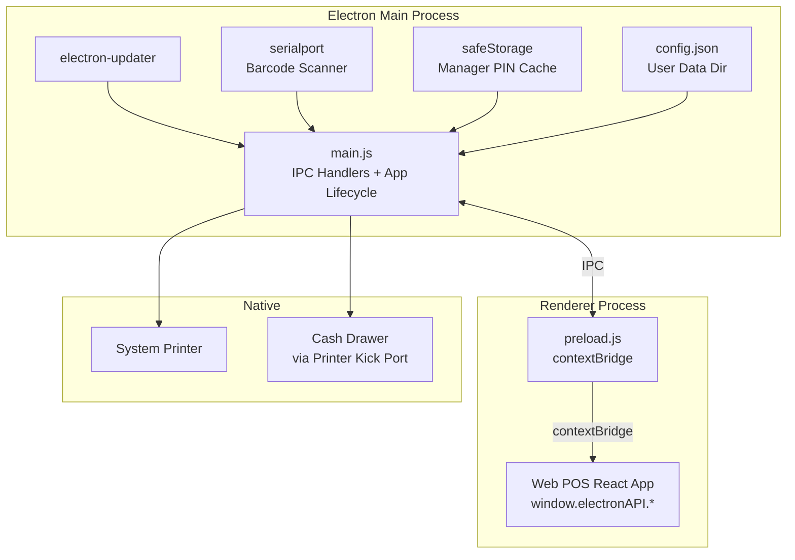

# Design Document: Desktop POS Parity (pos-sync)

## Overview

The desktop POS is an Electron application that wraps the web POS React app in a `BrowserWindow`. Currently it exposes only one native capability — receipt printing via IPC. The web POS already contains all business logic (cart, checkout, offline queue, fiscalization, shift management, manager overrides, reports, etc.).

This design covers the **Electron main process and preload bridge** changes needed to bring the desktop to full parity. The web POS runs unchanged inside the `BrowserWindow`; the work here is exposing the right native APIs so the web POS can use them, and adding desktop-only capabilities the web cannot provide.

The key principle: **the web POS detects the desktop context via `window.electronAPI.isElectron` and branches its behavior accordingly**. No separate web POS build is needed.

---

## Architecture



The architecture has three layers:

1. **Main process** (`desktop/main.js`) — registers `ipcMain.handle` handlers, manages the app lifecycle, integrates native libraries (electron-updater, serialport, safeStorage).
2. **Preload bridge** (`desktop/preload.js`) — uses `contextBridge.exposeInMainWorld` to expose a typed `window.electronAPI` object to the renderer. This is the only communication channel.
3. **Web POS renderer** — detects `window.electronAPI` and branches to use native APIs instead of web fallbacks (Print Server, toast-only cash drawer, etc.).

---

## Components and Interfaces

### `window.electronAPI` (Preload Bridge)

The complete API surface exposed to the renderer:

```typescript
interface ElectronAPI {
  // Identity
  isElectron: true;

  // Printing
  printReceipt: (html: string, printerName?: string) => Promise<boolean>;
  getPrinters: () => Promise<Array<{ name: string; isDefault: boolean }>>;
  testPrint: (printerName: string) => Promise<boolean>;

  // Cash Drawer
  openCashDrawer: (printerName?: string) => Promise<boolean>;

  // Auto-Updater
  onUpdateAvailable: (callback: (info: UpdateInfo) => void) => void;
  installUpdate: () => Promise<void>;

  // Barcode Scanner
  onBarcodeScan: (callback: (barcode: string) => void) => void;
  getSerialPorts: () => Promise<Array<{ path: string; manufacturer?: string }>>;

  // Manager PIN (offline verification)
  verifyManagerPin: (pin: string, companyId: number) => Promise<boolean>;
}
```

The `global.d.ts` in the web POS must be updated to reflect this full interface.

### IPC Channel Registry

| Channel | Direction | Handler |
|---|---|---|
| `print-receipt` | renderer → main | Render HTML in hidden window, print silently |
| `get-printers` | renderer → main | Return `webContents.getPrintersAsync()` |
| `test-print` | renderer → main | Print a test page to named printer |
| `open-cash-drawer` | renderer → main | Send ESC/POS kick bytes via raw print |
| `install-update` | renderer → main | Call `autoUpdater.quitAndInstall()` |
| `get-serial-ports` | renderer → main | Return `SerialPort.list()` |
| `verify-manager-pin` | renderer → main | Check PIN against `safeStorage` cache |
| `update-available` | main → renderer | Push update info to renderer |
| `barcode-scan` | main → renderer | Push scanned barcode string to renderer |

### IPC Input Validation

All `ipcMain.handle` handlers validate inputs before passing to native APIs:

- `html` content: must be a string, max 512 KB
- `printerName`: must be a string, max 256 chars, no path traversal characters
- `pin`: must be a string of 4–8 digits
- `companyId`: must be a positive integer

### `desktop/main.js` — Key Sections

```
createWindow()
  ├── BrowserWindow config (nodeIntegration:false, contextIsolation:true, kiosk from config)
  ├── Navigation guards (will-navigate, new-window-for-tab)
  ├── Menu.setApplicationMenu(null)
  └── loadURL(resolveStartUrl())

resolveStartUrl()
  ├── Read config.json from app.getPath('userData')
  ├── Fall back to ELECTRON_START_URL env var
  └── Fall back to compiled default (prod/dev)

registerIpcHandlers()
  ├── print-receipt
  ├── get-printers
  ├── test-print
  ├── open-cash-drawer
  ├── install-update
  ├── get-serial-ports
  └── verify-manager-pin

initAutoUpdater(mainWindow)
  └── autoUpdater events → mainWindow.webContents.send('update-available', info)

initBarcodeScanner(mainWindow, portPath)
  └── SerialPort data events → mainWindow.webContents.send('barcode-scan', barcode)
```

### `desktop/preload.js`

Exposes only the functions listed in the `ElectronAPI` interface above. Does **not** expose `ipcRenderer`, `require`, or any Node.js API directly.

### Web POS Integration Points

The web POS branches on `window.electronAPI` in these locations:

| File | Current behavior | Desktop behavior |
|---|---|---|
| `pos.tsx` (print) | POST to Print Server URL | `window.electronAPI.printReceipt(html, printerName)` |
| `pos.tsx` (cash drawer) | Toast notification only | `window.electronAPI.openCashDrawer(printerName)` |
| `pos-settings.tsx` (printers) | Fetch from Print Server | `window.electronAPI.getPrinters()` |
| `pos-settings.tsx` (UI) | Show Print Server URL field | Hide Print Server URL field |
| `pos-login.tsx` (update banner) | Not present | Listen on `onUpdateAvailable`, show banner |
| `pos.tsx` (barcode) | Keyboard-wedge only | Also listen on `onBarcodeScan` |
| `pos-settings.tsx` (manager PIN) | Online API only | `window.electronAPI.verifyManagerPin` when offline |

---

## Data Models

### `config.json` (User Data Directory)

```typescript
interface DesktopConfig {
  startUrl?: string;       // Override target URL
  kioskMode?: boolean;     // Enable kiosk window option
  scannerPort?: string;    // Serial port path for barcode scanner
  updateServerUrl?: string; // Override electron-updater feed URL
}
```

Stored at `app.getPath('userData')/config.json`. Read once at startup.

### Manager PIN Cache (safeStorage)

Stored in Electron's `safeStorage` (OS keychain-backed encrypted store):

```typescript
interface ManagerPinCache {
  [companyId: number]: {
    pinHash: string;   // SHA-256(pin + salt)
    salt: string;      // crypto.randomUUID()
    cachedAt: string;  // ISO timestamp
  }
}
```

Key: `manager-pin-cache`. Value: JSON-serialized, encrypted by `safeStorage.encryptString`.

### Printer Selection (localStorage, Web POS)

```
localStorage key: "pos_printer_name"
value: string (printer name as returned by getPrinters())
```

### `electron-builder` Publish Config (`package.json`)

```json
{
  "build": {
    "publish": {
      "provider": "generic",
      "url": "https://updates.fiscalstack.com/pos/"
    }
  }
}
```

---

## Correctness Properties

*A property is a characteristic or behavior that should hold true across all valid executions of a system — essentially, a formal statement about what the system should do. Properties serve as the bridge between human-readable specifications and machine-verifiable correctness guarantees.*

### Property 1: Silent print uses correct printer

*For any* receipt HTML string and optional printer name, calling the `print-receipt` IPC handler should invoke `webContents.print()` with `silent: true` and `deviceName` equal to the provided printer name (or `undefined` when none is provided, triggering the system default).

**Validates: Requirements 1.2, 1.3**

---

### Property 2: Print failure rejects with message

*For any* print attempt where the underlying print API signals failure, the `print-receipt` IPC handler should reject the promise with a non-empty error string.

**Validates: Requirements 1.5**

---

### Property 3: getPrinters returns valid shape

*For any* call to `get-printers`, every element in the returned array should have a `name` field (non-empty string) and an `isDefault` field (boolean).

**Validates: Requirements 1.6, 6.1**

---

### Property 4: Web POS routes print through electronAPI when available

*For any* receipt print triggered in the web POS, if `window.electronAPI` is defined, the call should go to `window.electronAPI.printReceipt` and not to the Print Server HTTP endpoint.

**Validates: Requirements 1.7**

---

### Property 5: Cash drawer sends correct ESC/POS byte sequence

*For any* call to `open-cash-drawer` with any printer name (including undefined), the raw bytes sent to the printer should contain the ESC/POS kick sequence `[0x1B, 0x70, 0x00, 0x19, 0xFA]` (ESC p 0 25 250).

**Validates: Requirements 2.2, 2.3**

---

### Property 6: Cash drawer failure rejects with message

*For any* call to `open-cash-drawer` where the printer is not found or the send fails, the promise should reject with a non-empty error string.

**Validates: Requirements 2.4**

---

### Property 7: Web POS calls openCashDrawer after sale when enabled

*For any* completed sale in the web POS where `window.electronAPI` is defined and cash drawer is enabled in POS settings, `window.electronAPI.openCashDrawer` should be called exactly once.

**Validates: Requirements 2.5**

---

### Property 8: Navigation to external URLs is blocked

*For any* URL that does not match the configured POS application URL, the `will-navigate` event handler should call `event.preventDefault()` and not allow the navigation.

**Validates: Requirements 3.2, 3.4**

---

### Property 9: New window creation is blocked

*For any* attempt to open a new window from within the renderer (e.g., `window.open`, target=_blank links), the `new-window-for-tab` / `setWindowOpenHandler` should prevent the new window from being created.

**Validates: Requirements 3.3**

---

### Property 10: Update available notification reaches renderer

*For any* `update-available` event emitted by `electron-updater`, the main process should send an IPC message to the renderer containing the update info object.

**Validates: Requirements 4.2**

---

### Property 11: Update check failure does not interrupt POS session

*For any* network error thrown during `autoUpdater.checkForUpdates()`, the error should be caught and logged, and the main window should continue to load and operate normally.

**Validates: Requirements 4.4**

---

### Property 12: Offline credential round-trip

*For any* email/password pair that was saved via `saveOfflineCredentials`, calling `verifyOfflineCredentials` with the same pair should return the cached user object; calling it with a different password should return null.

**Validates: Requirements 5.2**

---

### Property 13: Offline sale queuing round-trip

*For any* sale attempted while the network is offline, the sale data should appear in `getPendingSales` with status `pending`, and after a successful sync it should be removed from the pending store.

**Validates: Requirements 5.3, 5.4**

---

### Property 14: Sync triggered on connectivity restore

*For any* transition of the online state from `false` to `true`, the offline sync process should be triggered within the web POS.

**Validates: Requirements 5.4**

---

### Property 15: Settings uses getPrinters when electronAPI present

*For any* render of the POS settings page where `window.electronAPI` is defined, the printer list should be populated by calling `window.electronAPI.getPrinters()` and not by fetching from the Print Server URL.

**Validates: Requirements 6.2**

---

### Property 16: Printer name persisted in localStorage

*For any* printer selection made in the POS settings page, `localStorage.getItem('pos_printer_name')` should return the selected printer name.

**Validates: Requirements 6.3**

---

### Property 17: Print Server URL field hidden when electronAPI present

*For any* render of the POS settings page where `window.electronAPI` is defined, the Print Server URL input field should not be present in the rendered output.

**Validates: Requirements 6.4**

---

### Property 18: URL loaded from ELECTRON_START_URL when set

*For any* non-empty value of the `ELECTRON_START_URL` environment variable, the main window should load that URL regardless of whether the app is packaged or in development.

**Validates: Requirements 7.1**

---

### Property 19: config.json overrides compiled defaults

*For any* valid `config.json` in the user data directory containing a `startUrl` field, the main window should load that URL in preference to the `ELECTRON_START_URL` env var and the compiled defaults.

**Validates: Requirements 7.3, 7.4**

---

### Property 20: Barcode scan callback fires with correct value

*For any* data event received on the configured serial port, the registered `onBarcodeScan` callback in the renderer should be invoked with the trimmed barcode string, and the web POS should process it identically to a keyboard-wedge scan (same product lookup result).

**Validates: Requirements 8.2, 8.3**

---

### Property 21: Offline shift action queued and synced

*For any* shift open or close action taken while offline, the action should appear in `getPendingShifts` with status `pending`, and after connectivity is restored and sync runs, it should be removed from the pending store.

**Validates: Requirements 9.2**

---

### Property 22: Manager PIN verification round-trip

*For any* successful online PIN verification, the PIN should be cached in `safeStorage`. Subsequently, calling `verify-manager-pin` offline with the same PIN and company ID should return `true`; calling it with a different PIN should return `false`.

**Validates: Requirements 10.2, 10.3, 10.4**

---

### Property 23: Offline reports show cached data with notice

*For any* render of the POS reports page while the network is offline, the page should display data sourced from the IndexedDB cache and include a visible "offline — data may be incomplete" notice.

**Validates: Requirements 11.3**

---

### Property 24: Receipt HTML contains required fiscal fields

*For any* fiscalized invoice rendered by `Receipt48`, the resulting HTML should contain the ZIMRA QR code element and the verification code. For any unfiscalized offline sale, the HTML should contain the text "PENDING FISCALIZATION" in place of the QR code.

**Validates: Requirements 12.2, 12.3**

---

### Property 25: Receipt round-trip equivalence

*For any* receipt data object, the HTML produced by the `Receipt48` component should be identical whether the print path goes through `window.electronAPI.printReceipt` or the web POS browser print path.

**Validates: Requirements 12.4**

---

### Property 26: IPC input validation rejects oversized or malformed data

*For any* IPC message where `html` exceeds 512 KB, `printerName` contains path traversal characters, `pin` is not 4–8 digits, or `companyId` is not a positive integer, the handler should reject the promise with a validation error before passing data to any native API.

**Validates: Requirements 13.5**

---

## Error Handling

### Print Errors

The `print-receipt` handler wraps the hidden `BrowserWindow` lifecycle in a try/catch. If `did-finish-load` does not fire within 10 seconds, the window is destroyed and the promise rejects with a timeout error. The print callback's `errorType` string is forwarded directly in the rejection message.

### Cash Drawer Errors

The `open-cash-drawer` handler catches errors from the raw print send and rejects with the OS error message. The web POS catches this rejection and shows a toast notification so the cashier can open the drawer manually.

### Auto-Updater Errors

`autoUpdater.on('error', ...)` catches all update errors. The error is logged to the Electron log file (`electron-log`) and a non-blocking toast is sent to the renderer. The POS session continues uninterrupted.

### Config Load Errors

If `config.json` is malformed JSON, the error is caught and logged; the app falls back to env var / compiled defaults. A missing file is not an error.

### Serial Port Errors

If the configured serial port cannot be opened (device not connected), the error is logged and `onBarcodeScan` is never registered. The web POS falls back to keyboard-wedge scanning transparently.

### IPC Validation Errors

Handlers return structured error objects `{ error: string, code: 'VALIDATION_ERROR' }` for invalid inputs rather than throwing, so the renderer can distinguish validation failures from runtime failures.

---

## Testing Strategy

### Dual Testing Approach

Both unit tests and property-based tests are required. Unit tests cover specific examples, integration points, and error conditions. Property-based tests verify universal correctness across all valid inputs.

### Unit Tests

Focus areas:
- `resolveStartUrl()` — specific examples for each priority level (config.json > env var > packaged default > dev default)
- Navigation guard — specific URL examples (same origin allowed, external blocked)
- IPC input validation — specific invalid inputs (empty string, oversized HTML, non-numeric companyId)
- Manager PIN cache — specific encode/decode cycle with known values
- `Receipt48` rendering — specific fiscalized and unfiscalized invoice fixtures

### Property-Based Tests

Use **fast-check** (TypeScript/JavaScript property-based testing library) for all property tests. Configure each test to run a minimum of **100 iterations**.

Each property test must include a comment referencing the design property:
```
// Feature: pos-sync, Property N: <property text>
```

Property test targets (one test per property):

| Property | Test Description |
|---|---|
| P1 | Arbitrary HTML + optional printer name → `webContents.print` called with `silent:true` and correct `deviceName` |
| P2 | Arbitrary print failure signal → promise rejects with non-empty string |
| P3 | `getPrinters()` result → every element has `name: string` and `isDefault: boolean` |
| P4 | Arbitrary receipt trigger with `electronAPI` defined → Print Server fetch never called |
| P5 | Arbitrary printer name (including undefined) → raw bytes contain ESC/POS kick sequence |
| P6 | Arbitrary invalid printer → promise rejects with non-empty string |
| P7 | Arbitrary completed sale with cash drawer enabled → `openCashDrawer` called once |
| P8 | Arbitrary non-POS URL → `event.preventDefault()` called |
| P9 | Arbitrary `window.open` call → new window not created |
| P10 | Arbitrary update info object → renderer receives it via IPC |
| P11 | Arbitrary network error during update check → main window loads normally |
| P12 | Arbitrary email/password → save then verify returns user; wrong password returns null |
| P13 | Arbitrary sale data while offline → appears in pending store; after sync, removed |
| P14 | Arbitrary online→offline→online transition → sync triggered on restore |
| P15 | Arbitrary settings render with `electronAPI` → `getPrinters()` called, not Print Server |
| P16 | Arbitrary printer selection → `localStorage.getItem('pos_printer_name')` returns it |
| P17 | Arbitrary settings render with `electronAPI` → Print Server URL field absent |
| P18 | Arbitrary `ELECTRON_START_URL` value → that URL is loaded |
| P19 | Arbitrary `config.json` with `startUrl` → that URL is loaded |
| P20 | Arbitrary serial port data event → callback fires with trimmed barcode; product lookup matches keyboard-wedge result |
| P21 | Arbitrary shift action while offline → queued; after sync, removed |
| P22 | Arbitrary PIN + companyId → online verify caches; offline verify with same PIN returns true, different PIN returns false |
| P23 | Arbitrary offline state → reports page shows IndexedDB data + offline notice |
| P24 | Arbitrary fiscalized invoice → HTML contains QR + verification code; unfiscalized → contains watermark |
| P25 | Arbitrary receipt data → HTML identical across both print paths |
| P26 | Arbitrary oversized/malformed IPC input → handler rejects before calling native API |

### Integration Tests

End-to-end tests using **Spectron** or **Playwright with Electron** to verify:
- App launches and loads the POS URL
- `window.electronAPI` is available in the renderer
- Print dialog does not appear when `printReceipt` is called
- Navigation to `https://example.com` is blocked
