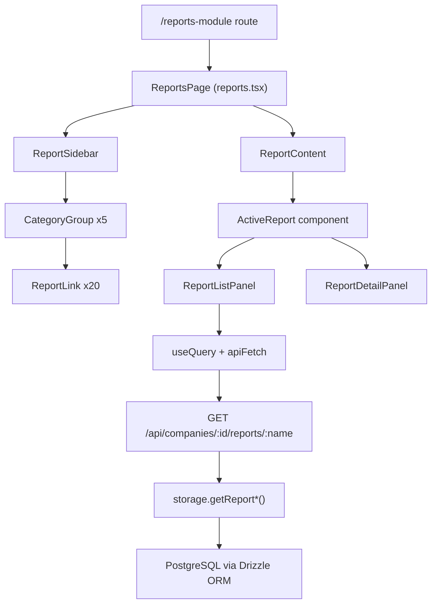

# Design Document: Reports Module

## Overview

The Reports Module is a single-page React component at `/reports-module` that provides a comprehensive reporting interface for the fiscalization/invoicing application. It follows the established two-panel layout pattern from `invoice-details.tsx`: a fixed-width left sidebar for navigation and a flexible right content area for report data.

The module covers five report categories (Sales, Receivables, Payments Received, Purchases & Expenses, Taxes) with 20 individual reports. Each report renders its own list+detail sub-panels within the right content area. All data is scoped to the active company via the `useActiveCompany` hook.

Key design decisions:
- Single page component — no full-page navigations between reports
- Reuse the existing `/payments-received` page for the "Payments Received" report (external link)
- All new backend endpoints follow the existing `GET /api/companies/:companyId/reports/:reportName` pattern
- Frontend uses the existing `useQuery` + `apiFetch` pattern
- Export is client-side CSV generation from already-fetched data

---

## Architecture



### Component Hierarchy

```
ReportsPage
├── ReportSidebar
│   ├── CategoryGroup (Sales)
│   │   ├── ReportLink (Sales)
│   │   ├── ReportLink (Sales by Customer)
│   │   ├── ReportLink (Sales by Item)
│   │   └── ReportLink (Sales by Sales Person)
│   ├── CategoryGroup (Receivables)
│   │   └── ReportLink x9
│   ├── CategoryGroup (Payments Received)
│   │   └── ReportLink x4
│   ├── CategoryGroup (Purchases & Expenses)
│   │   └── ReportLink x5
│   └── CategoryGroup (Taxes)
│       └── ReportLink (Tax Summary)
└── ReportContent
    ├── DateRangePicker (shared)
    ├── SearchInput (shared)
    ├── StatBar (shared)
    └── <ActiveReport> (one of 20 report sub-components)
        ├── ReportListPanel
        └── ReportDetailPanel
```

### Data Flow

1. User selects a report from the sidebar → `activeReport` state updates
2. `ReportContent` renders the matching report sub-component
3. Sub-component calls `useQuery` with the report endpoint + date range params
4. On data load, the list panel renders rows; clicking a row sets `selectedRow` state
5. The detail panel renders the selected row's breakdown
6. Export button triggers client-side CSV generation from the current filtered data

---

## Components and Interfaces

### ReportsPage (`client/src/pages/reports.tsx`)

Top-level page component. Manages:
- `activeReport: string` — currently selected report key (e.g. `"sales"`, `"ar-aging-summary"`)
- `openCategories: Set<string>` — which sidebar categories are expanded

```tsx
interface ReportDefinition {
  key: string;
  label: string;
  category: string;
  endpoint?: string;       // undefined for external links
  externalHref?: string;   // for "Payments Received" → /payments-received
}
```

### ReportSidebar

Props: `{ activeReport, onSelect, openCategories, onToggleCategory }`

Renders 5 `CategoryGroup` components. Each group uses shadcn `Collapsible`. Active report link gets `bg-violet-600 text-white` styling (matching the existing nav pattern in `layout.tsx`).

### ReportContent

Props: `{ report, companyId, dateRange, onDateRangeChange, search, onSearchChange }`

Renders the shared controls (date picker, quick-select buttons, search, stat bar) and delegates to the active report sub-component.

### Shared Controls

- `DateRangePicker` — reuses the existing `Popover` + `Calendar` pattern from `payments-received.tsx`
- Quick-select buttons: "This Month", "Last Month", "This Quarter", "All Time"
- `SearchInput` — client-side filter, `Input` with `Search` icon
- `StatBar` — displays 2–4 key aggregates (total amount, record count, etc.)
- `ExportButton` — triggers CSV download from current filtered data

### Report Sub-Components

Each report is a self-contained component that receives `{ companyId, dateRange, search }` and manages its own `selectedRow` state. Pattern:

```tsx
function SalesReport({ companyId, dateRange, search }: ReportProps) {
  const { data, isLoading, error } = useQuery({
    queryKey: ["/api/companies/reports/sales-summary", companyId, dateRange],
    queryFn: () => apiFetch(`/api/companies/${companyId}/reports/sales-summary?...`).then(r => r.json())
  });
  const [selectedRow, setSelectedRow] = useState<any>(null);
  // ... renders list + detail panels
}
```

### Report Props Interface

```tsx
interface ReportProps {
  companyId: number;
  dateRange: { from: Date; to: Date };
  search: string;
}
```

---

## Data Models

### API Response Shapes

**Sales Summary** (`/reports/sales-summary`)
```ts
{ date: string; invoiceCount: number; subtotal: string; taxAmount: string; total: string }[]
```

**Sales by Customer** (`/reports/sales-by-customer`)
```ts
{ customerId: number; customerName: string; invoiceCount: number; total: string }[]
```

**Sales by Item** (`/reports/sales-by-item`)
```ts
{ productId: number | null; description: string; quantitySold: string; revenue: string }[]
```

**Sales by Sales Person** (`/reports/sales-by-salesperson`)
```ts
{ userId: string; userName: string; invoiceCount: number; total: string }[]
```

**AR Aging Summary** (`/reports/ar-aging-summary`)
```ts
{ customerId: number; customerName: string; current: string; days31_60: string; days61_90: string; days90plus: string; total: string }[]
```

**AR Aging Details** (`/reports/ar-aging-details`)
```ts
{ invoiceId: number; invoiceNumber: string; customerName: string; dueDate: string; daysOverdue: number; balanceDue: string; bucket: "current" | "31-60" | "61-90" | "90+" }[]
```

**Invoice Details** (`/reports/invoice-details`)
```ts
{ invoiceId: number; invoiceNumber: string; customerName: string; issueDate: string; dueDate: string; status: string; total: string; paidAmount: string; balanceDue: string }[]
```

**Quote Details** (`/reports/quote-details`)
```ts
{ quotationId: number; quotationNumber: string; customerName: string; issueDate: string; expiryDate: string | null; status: string; total: string }[]
```

**Customer Balance Summary** (`/reports/customer-balance-summary`)
```ts
{ customerId: number; customerName: string; totalInvoiced: string; totalPaid: string; balance: string }[]
```

**Receivable Summary** (`/reports/receivable-summary`)
```ts
{ totalInvoiced: string; totalCollected: string; totalOutstanding: string }
```

**Receivable Details** (`/reports/receivable-details`)
```ts
{ invoiceId: number; invoiceNumber: string; customerName: string; issueDate: string; total: string; paidAmount: string; balanceDue: string; status: string }[]
```

**Bad Debts** (`/reports/bad-debts`)
```ts
{ invoiceId: number; invoiceNumber: string; customerName: string; dueDate: string; daysOverdue: number; balanceDue: string }[]
```

**Bank Charges** (`/reports/bank-charges`)
```ts
{ paymentId: number; invoiceNumber: string; customerName: string; paymentDate: string; reference: string; amount: string }[]
```

**Time to Get Paid** (`/reports/time-to-get-paid`)
```ts
{ invoiceId: number; invoiceNumber: string; customerName: string; issueDate: string; paymentDate: string; daysToPayment: number; amount: string }[]
```

**Refund History** (`/reports/refund-history`)
```ts
{ invoiceId: number; invoiceNumber: string; customerName: string; issueDate: string; amount: string; relatedInvoiceNumber: string | null }[]
```

**Withholding Tax** (`/reports/withholding-tax`)
```ts
{ invoiceId: number; invoiceNumber: string; customerName: string; issueDate: string; withheldAmount: string; total: string }[]
```

**Expense Details** (`/reports/expense-details`)
```ts
{ expenseId: number; expenseDate: string; category: string; description: string; supplierName: string | null; paymentMethod: string | null; reference: string | null; amount: string; currency: string }[]
```

**Expenses by Category** (`/reports/expenses-by-category`)
```ts
{ category: string; total: string; percentage: string; count: number }[]
```

**Expenses by Customer** (`/reports/expenses-by-customer`)
```ts
{ supplierId: number | null; supplierName: string; total: string; count: number }[]
```

**Expenses by Project** (`/reports/expenses-by-project`)
```ts
{ project: string; total: string; count: number }[]
```

**Billable Expense Details** (`/reports/billable-expense-details`)
```ts
{ expenseId: number; expenseDate: string; category: string; description: string; amount: string; status: string }[]
```

**Tax Summary** (`/reports/tax-summary`)
```ts
{ taxCode: string; taxName: string; taxRate: string; taxableAmount: string; outputTax: string; inputTax: string; netVat: string }[]
```

### Backend Query Strategy

All report endpoints follow this pattern in `server/routes.ts`:

```ts
app.get("/api/companies/:companyId/reports/:reportName", requireAuth, async (req, res) => {
  const companyId = parseInt(req.params.companyId);
  // Authorization check
  const userCompanies = await storage.getCompanies(req.user.id);
  if (!req.user.isSuperAdmin && !userCompanies.find(c => c.id === companyId)) {
    return res.status(403).json({ message: "Forbidden" });
  }
  // Date range with defaults
  const startDate = req.query.startDate ? new Date(req.query.startDate as string) : startOfMonth(new Date());
  const endDate = req.query.endDate ? new Date(req.query.endDate as string) : endOfMonth(new Date());
  // Delegate to storage method
  const data = await storage.getReport<reportName>(companyId, startDate, endDate);
  res.json(data);
});
```

Storage methods use Drizzle ORM with `gte`/`lte` on indexed date columns (`issueDate`, `expenseDate`) and `eq` on `companyId`.

---

## Correctness Properties

*A property is a characteristic or behavior that should hold true across all valid executions of a system — essentially, a formal statement about what the system should do. Properties serve as the bridge between human-readable specifications and machine-verifiable correctness guarantees.*

### Property 1: Client-side search filtering correctness

*For any* report list and any non-empty search string, every record in the filtered result must contain the search string (case-insensitive) in at least one of its searchable text fields, and no record that does not match should appear in the result.

**Validates: Requirements 2.4**

---

### Property 2: Summary stat bar aggregates match filtered data

*For any* filtered list of report records, the total amount displayed in the stat bar must equal the arithmetic sum of the `total` (or `amount`) field across all records in the filtered list.

**Validates: Requirements 2.5**

---

### Property 3: Row selection updates detail panel

*For any* report with a list+detail layout and any row in the list, clicking that row must cause the detail panel to display data corresponding exclusively to that row's record (identified by its unique ID).

**Validates: Requirements 3.2, 3.4, 3.6, 3.8, 4.2, 4.5, 4.7, 4.9, 5.3, 5.5, 6.2, 6.4, 7.2**

---

### Property 4: AR aging bucket assignment correctness

*For any* invoice with a known due date and a known current date, the aging bucket assigned by the AR aging report must be:
- "current" if `daysOverdue <= 0`
- "31-60" if `31 <= daysOverdue <= 60`
- "61-90" if `61 <= daysOverdue <= 90`
- "90+" if `daysOverdue > 90`

**Validates: Requirements 4.1, 4.3**

---

### Property 5: Net VAT calculation correctness

*For any* set of invoices and expenses within a date range, the net VAT figure for each tax type must equal the sum of `taxAmount` from invoices for that tax type minus the sum of tax-equivalent amounts from expenses for that tax type.

**Validates: Requirements 7.3, 7.4**

---

### Property 6: Server authorization — 403 for unauthorized company access

*For any* authenticated user and any `companyId` that does not belong to that user's companies, every report endpoint must return HTTP 403 and must not return any data.

**Validates: Requirements 8.2, 8.7**

---

### Property 7: Server date range filtering — all returned records within range

*For any* report endpoint called with `startDate` and `endDate` parameters, every record in the response must have its primary date field (e.g. `issueDate`, `expenseDate`, `paymentDate`) fall within `[startDate, endDate]` inclusive.

**Validates: Requirements 8.3**

---

### Property 8: Monetary amounts formatted as strings with two decimal places

*For any* monetary value returned by any report endpoint, the value must be a string matching the pattern `^\d+\.\d{2}$` (non-negative number with exactly two decimal places).

**Validates: Requirements 8.5**

---

### Property 9: CSV export rows match filtered list

*For any* report in any filtered state (date range + search), the number of data rows in the exported CSV must equal the number of records in the currently visible filtered list, and each CSV row must correspond to the matching list record.

**Validates: Requirements 9.3**

---

### Property 10: CSV filename follows naming pattern

*For any* report name and any selected date range, the downloaded CSV filename must match the pattern `{report-name}-{startDate}-{endDate}.csv` where dates are formatted as `yyyy-MM-dd`.

**Validates: Requirements 9.4**

---

## Error Handling

### Frontend

| Scenario | Handling |
|---|---|
| No active company | Render a centered prompt: "Please select a company to view reports" |
| API request fails | Show error message with report name and a "Retry" button that re-triggers the query |
| Loading state | Show `Loader2` spinner in place of list and detail panels |
| Empty data | Show empty state illustration with contextual message (e.g. "No sales in this period") |
| Invalid date range (from > to) | Swap dates automatically; show a toast notification |
| Export with no data | Disable the Export button when the filtered list is empty |

### Backend

| Scenario | HTTP Response |
|---|---|
| Unauthenticated request | 401 Unauthorized |
| CompanyId not belonging to user | 403 Forbidden |
| Invalid date format in query params | 400 Bad Request with message |
| Database error | 500 Internal Server Error with sanitized message |
| Missing companyId param | 400 Bad Request |

All monetary values are cast to `NUMERIC` in SQL and formatted with `toFixed(2)` before serialization to ensure consistent string output.

---

## Testing Strategy

### Unit Tests

Unit tests focus on specific examples, edge cases, and pure functions:

- Render `ReportSidebar` and assert all 5 categories and 20 report links are present
- Render `ReportsPage` with no active company and assert the prompt is shown
- Test the AR aging bucket assignment function with boundary values: 0, 1, 30, 31, 60, 61, 90, 91 days overdue
- Test the CSV generation function with a known dataset and assert the output matches expected CSV string
- Test the CSV filename generation function with various report names and date ranges
- Test the net VAT calculation function with known invoice and expense data
- Test the date range default logic: calling without params should scope to current month

### Property-Based Tests

Property-based tests use **fast-check** (already available in the JS ecosystem) to validate universal properties across randomly generated inputs. Each test runs a minimum of **100 iterations**.

**Tag format: `Feature: reports-module, Property {N}: {property_text}`**

```
// Feature: reports-module, Property 1: Client-side search filtering correctness
test("search filter only returns matching records", () => {
  fc.assert(fc.property(
    fc.array(fc.record({ customerName: fc.string(), invoiceNumber: fc.string(), total: fc.string() })),
    fc.string({ minLength: 1 }),
    (records, searchTerm) => {
      const filtered = filterRecords(records, searchTerm);
      return filtered.every(r =>
        r.customerName.toLowerCase().includes(searchTerm.toLowerCase()) ||
        r.invoiceNumber.toLowerCase().includes(searchTerm.toLowerCase())
      );
    }
  ), { numRuns: 100 });
});
```

```
// Feature: reports-module, Property 2: Summary stat bar aggregates match filtered data
test("stat bar total equals sum of filtered records", () => {
  fc.assert(fc.property(
    fc.array(fc.record({ total: fc.float({ min: 0, max: 100000 }) })),
    (records) => {
      const total = computeTotal(records);
      return Math.abs(total - records.reduce((s, r) => s + r.total, 0)) < 0.001;
    }
  ), { numRuns: 100 });
});
```

```
// Feature: reports-module, Property 4: AR aging bucket assignment correctness
test("aging bucket is correctly assigned for any days overdue value", () => {
  fc.assert(fc.property(
    fc.integer({ min: -365, max: 730 }),
    (daysOverdue) => {
      const bucket = getAgingBucket(daysOverdue);
      if (daysOverdue <= 0) return bucket === "current";
      if (daysOverdue <= 30) return bucket === "current";
      if (daysOverdue <= 60) return bucket === "31-60";
      if (daysOverdue <= 90) return bucket === "61-90";
      return bucket === "90+";
    }
  ), { numRuns: 100 });
});
```

```
// Feature: reports-module, Property 6: Server authorization
test("report endpoints return 403 for unauthorized companyId", async () => {
  await fc.assert(fc.asyncProperty(
    fc.integer({ min: 99000, max: 99999 }), // IDs that don't belong to test user
    async (companyId) => {
      const res = await request(app)
        .get(`/api/companies/${companyId}/reports/sales-summary`)
        .set("Cookie", authenticatedCookie);
      return res.status === 403;
    }
  ), { numRuns: 100 });
});
```

```
// Feature: reports-module, Property 7: Date range filtering
test("all returned records fall within the requested date range", async () => {
  await fc.assert(fc.asyncProperty(
    fc.date({ min: new Date("2023-01-01"), max: new Date("2024-01-01") }),
    fc.date({ min: new Date("2024-01-01"), max: new Date("2025-01-01") }),
    async (startDate, endDate) => {
      const data = await fetchReport("sales-summary", companyId, startDate, endDate);
      return data.every(r => {
        const d = new Date(r.date);
        return d >= startDate && d <= endDate;
      });
    }
  ), { numRuns: 100 });
});
```

```
// Feature: reports-module, Property 8: Monetary amount format
test("all monetary values are strings with exactly two decimal places", async () => {
  await fc.assert(fc.asyncProperty(
    fc.constantFrom("sales-summary", "expense-details", "tax-summary"),
    async (reportName) => {
      const data = await fetchReport(reportName, companyId, startDate, endDate);
      const monetaryFields = ["total", "amount", "subtotal", "taxAmount", "outputTax", "inputTax"];
      return data.every(row =>
        monetaryFields
          .filter(f => f in row)
          .every(f => /^\d+\.\d{2}$/.test(row[f]))
      );
    }
  ), { numRuns: 100 });
});
```

```
// Feature: reports-module, Property 9: CSV export matches filtered list
test("CSV row count matches filtered list length", () => {
  fc.assert(fc.property(
    fc.array(fc.record({ id: fc.integer(), customerName: fc.string(), total: fc.string() })),
    fc.string(),
    (records, searchTerm) => {
      const filtered = filterRecords(records, searchTerm);
      const csv = generateCsv(filtered, ["id", "customerName", "total"]);
      const csvRows = csv.trim().split("\n").slice(1); // exclude header
      return csvRows.length === filtered.length;
    }
  ), { numRuns: 100 });
});
```

```
// Feature: reports-module, Property 10: CSV filename pattern
test("CSV filename matches {report-name}-{startDate}-{endDate}.csv", () => {
  fc.assert(fc.property(
    fc.constantFrom("sales", "ar-aging-summary", "expense-details", "tax-summary"),
    fc.date({ min: new Date("2020-01-01"), max: new Date("2025-12-31") }),
    fc.date({ min: new Date("2020-01-01"), max: new Date("2025-12-31") }),
    (reportName, startDate, endDate) => {
      const filename = generateCsvFilename(reportName, startDate, endDate);
      const expected = new RegExp(`^${reportName}-\\d{4}-\\d{2}-\\d{2}-\\d{4}-\\d{2}-\\d{2}\\.csv$`);
      return expected.test(filename);
    }
  ), { numRuns: 100 });
});
```

### Integration Tests

- Each report endpoint returns 200 with valid JSON for an authenticated user with a valid companyId
- Each report endpoint returns 403 for a companyId not belonging to the authenticated user
- Date range defaults: calling without `startDate`/`endDate` returns only current-month records
- The "Payments Received" link navigates to `/payments-received` (not an inline report)
